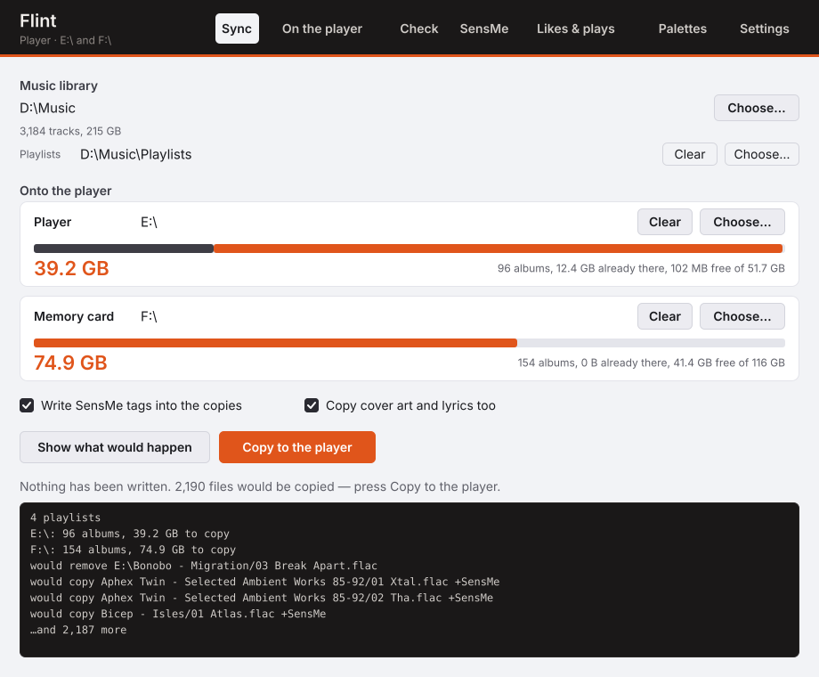
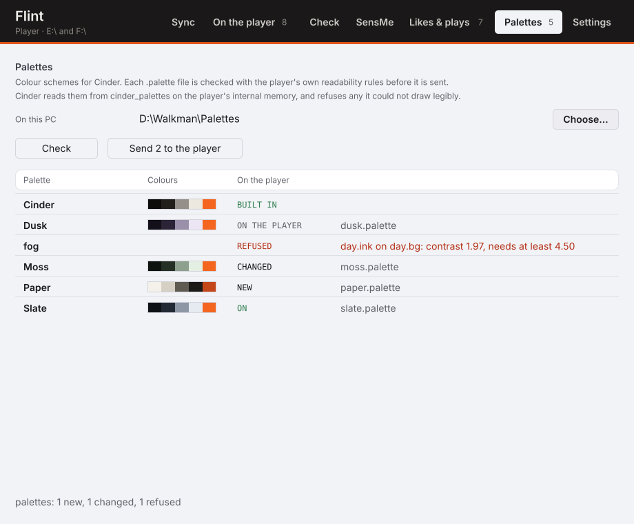
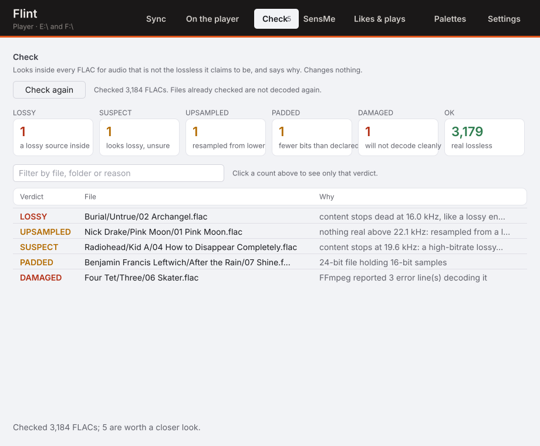
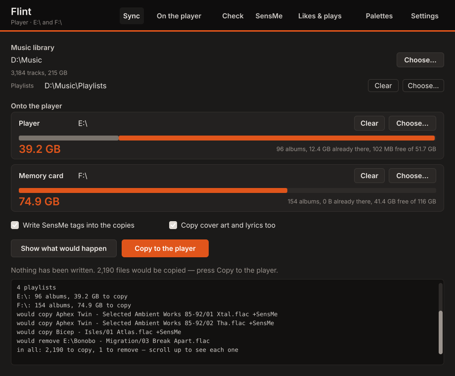

# Flint

A PC companion for the Sony NW-A50-series Walkman and [Cinder](https://github.com/superwilso/Cinder):
copy a music library onto the player, keep likes and scrobbles in step, and give every track Sony's
**SensMe** mood and tempo data — without touching the files on your PC.

**Status: usable, young.** [v0.2.0](https://github.com/superwilso/flint/releases/latest) is out:
`flint-windows-x64.exe`, the 32-bit `sensme-helper-x86.exe` that goes beside it, and
`flint-linux-x64`, with SHA-256 sums on the release page and a Sigstore build attestation for each
file. `main` can be ahead of it: [`CHANGELOG.md`](CHANGELOG.md)'s *Unreleased* section says by
what. Flint replaces the Python `Sony-sync` tool. Nothing Flint does touches the files on your PC; everything it writes goes to the player.

## Getting started

1. Download `flint-windows-x64.exe` (and `sensme-helper-x86.exe`, if you want SensMe) from
   [Releases](https://github.com/superwilso/flint/releases/latest) into one folder.
2. Plug the Walkman in as a USB drive and run `flint-windows-x64.exe`. The window opens.
3. **Sync** page: choose your music folder, then the player's drive (and its card, if it has one).
4. Press **Show what would happen**. Nothing is written; the plan and the space it needs are shown.
5. Press **Copy to the player**.

The window remembers the folders for next time. Everything it does is also a command, below.

## SensMe, without the bloat

SensMe channels on the Walkman need an analysis tag in each file. Sony's Music Center writes one into
your PC library, and those files have been reported to grow by almost a megabyte each. Flint does it
differently:

* It runs **Sony's own analysis engine** (`MMLib11.dll`, installed with Music Center for PC) over each
  track once, and keeps the result in its own cache — about 6 KB per track.
* It writes that 6 KB **only into the copy it puts on the Walkman** — a FLAC `SMFM` block or an MP3
  `GEOB` frame, the same containers Sony uses. Your PC files are never modified.
* The Walkman's own scanner turns the tag into channels, the same as for Music Center's tags — so this
  works on stock firmware as well as Cinder.

Flint does not include Sony's engine. SensMe analysis needs Music Center for PC installed on the same
Windows machine; everything else in Flint works without it.

### If you already use Music Center

Then the analysis is done and Flint will not do it again:

* **Tags already inside your files** are taken as they stand. `flint scan` and `flint sync` read
  them, and say how many they found. No decode, no engine run.
* **Music Center's own cache** — it analyses far more tracks than it writes tags for — comes in with
  `flint import`. It reads `%APPDATA%\Sony\Music Center`, writes nothing back, and keys each result
  against the audio it belongs to.
* Either way the copy on the Walkman carries only the part the player reads, so a Music Center tag
  that had grown to a megabyte arrives as about 6 KB.

A feature-by-feature comparison with Music Center, including what Flint deliberately does not do and
what is still missing, is in [`docs/MUSIC_CENTER.md`](docs/MUSIC_CENTER.md).

## The window

On Windows, `flint` with no arguments opens one. Seven pages, one tab each:



| Page | What it answers |
|---|---|
| **Sync** | What would be copied, removed and tagged, and does it fit. Then the copy. |
| **On the player** | What is on each drive, and whether Flint put it there (read from `flint-manifest.tsv`). |
| **Check** | Which FLACs are not the lossless audio they claim to be, and why (below). |
| **SensMe** | Analyse the library, or import what Music Center already analysed. |
| **Likes & plays** | The plays in the player's `.scrobbler.log` and the songs liked on it. |
| **Palettes** | Which of your colour schemes for Cinder the player would accept, and why not. Then Send. |
| **Settings** | Theme (Light, Dark or System), the folders, the analysis cache, Last.fm. |

Only **Sync** writes music to the player, and only Sync has anything orange on it. The other pages
read — "Read the player" reads — except **Palettes ▸ Send**, which copies the few small `.palette`
files its check passed into `cinder_palettes/`. The check uses Cinder's own contrast rules, so a
palette the player would refuse is refused on the PC, with the reason, before it is ever copied.





On **Sync**: choose a music folder and the player's drive, press **Show what would happen** —
nothing is written — and then **Copy to the player**. Copy is only ever offered for a plan you have
already been shown, and changing any setting takes it away again until you look at the new one.

One control at a time is in Flint's orange, and it is always the next thing to do: the folder
first, then the drive, then the plan, then the copy. Each destination carries a bar of its own
capacity — what is on it already in graphite, what this copy would add in orange, and what would
still be free — because "will it fit" is the question a 16 GB player asks of a library that does
not. The same orange marks the bytes about to be written, and nothing else.

By default it follows Windows' own light/dark setting, and changes with it while it is open;
Settings ▸ Theme picks Light or Dark instead. The orange does not move between the two, because it
means "the next thing to do" and a colour that changed with the theme could not carry a meaning:



`flint gui --dark` or `--light` overrides the theme for one run. The folders, the two switches and
the theme are kept in `gui.conf` beside the analysis cache.

It draws its own window with no toolkit and no dependencies, the same approach as Cinder's
installer, and everything it does goes through the same code the commands below do. The layout is
plain Rust with no Windows in it, which is why the pictures above can be drawn anywhere:

```
flint gui-preview window.svg --state planned     # or fresh, ready, working, done
flint gui-preview window-dark.svg --state planned --dark
flint gui-preview check.svg --state check        # or player, sensme, likes, palettes, settings
```

What the pages grow into next — a plan you can tick, conversion to fit a card, SensMe channel
counts, sending plays and likes from the window — is in
Cinder's [`docs/PLAN_redesign_2026-09.md`](https://github.com/superwilso/Cinder/blob/main/docs/PLAN_redesign_2026-09.md).

## Copying a library to the player

```
flint scan "D:\\Music"                              analyse once, into Flint's cache
flint sync "D:\\Music" --to E:\\ --to F:\\ --playlists "D:\\Playlists"     a dry run
flint sync "D:\\Music" --to E:\\ --to F:\\ --playlists "D:\\Playlists" --apply
```

Cover art and lyrics (`.jpg`, `.png`, `.lrc`) sitting in an album's folder travel with it. They are
copied, never swept: deleting artwork another tool put on the player is not a call a sync should
make.

Albums are the unit that moves, and an album is never split across the internal memory and the card.
Albums that share a playlist stay together, so no playlist spans two volumes, and an album already on
a volume stays there. Each volume gets whatever space is free on it, less half a gigabyte of
headroom; `--gb N` sets a budget instead. `--no-sensme` copies without tagging.

Each copy is written to a temporary file and renamed, so an interrupted transfer leaves either the
old file or the new one. Every volume carries `flint-manifest.tsv`, recording what each copy was made
from — without it, a SensMe-tagged copy is larger than its source and would be copied again on every
run, for ever.

## Scrobbles and liked songs

The Walkman has no WiFi, so it cannot reach Last.fm itself. It writes files instead, and Flint
carries them:

```
flint lastfm key <api-key> <api-secret>     once — https://www.last.fm/api/account/create
flint lastfm login <your-username>          once — the password is exchanged for a session key
flint lastfm status                         what is configured, and whether Last.fm answers

flint scrobble E:\                          what would be sent
flint scrobble E:\ --apply                  send it

flint likes E:\ F:\                         what would change, both directions
flint likes E:\ F:\ --apply --playlist      do it, and write Liked Songs.m3u8
```

**Scrobbles.** Cinder appends an Audioscrobbler/1.1 `.scrobbler.log` at the root of the player's
storage. `flint scrobble` reads it, sends the plays fifty at a time, and removes from the file only
the rows Last.fm actually **accepted** — anything it refused stays, with the reason printed, and so
does any row this version cannot parse. Skipped-track rows are never sent: Last.fm has no call that
would take them.

**Liked songs.** Cinder exports `cinder_loved.tsv` whenever the liked set changes and reads
`cinder_liked_import.tsv` back. `flint likes` merges that with Last.fm's loved tracks and pushes the
result both ways.

It is a sync, not a merge, which means it has a memory: `likes-state.tsv` beside the scan cache
records what each side looked like after the last run. Without it, a track that is on Last.fm and
not on the player is ambiguous — just loved over there, or just unliked over here? — and guessing
deletes a hand-curated list. From that one rule the rest follows:

* the **first run is additive**: everything on both sides is kept, nothing is removed anywhere;
* **an unplugged player proves nothing** — a source that cannot be read this run causes no removals;
* while the player has an import **it has not merged yet**, its own export is still the old list, so
  it is treated as additive only and the pending push does not come back as an unlove;
* a track that changed on both sides **keeps the like**.

Matching is by artist and title, folded the same way Cinder folds them on the device: case, curly
punctuation, `feat.` credits and re-issue suffixes (`- 2011 Remaster`, `(Deluxe Edition)`) come out,
while anything that marks a *different recording* — live, remix, acoustic, demo — stays distinct.

`--playlist` also writes `Liked Songs.m3u8` into each volume's music folder, holding only that
volume's own tracks. It is off by default because it reads the tags of every file on the player over
USB; the hearts on the device need no such thing.

Everything here goes out over **the system's own TLS** — WinHTTP on Windows, the same stack every
other program on the machine uses, with its proxy settings and its certificate store. Flint adds no
crates for it, and your password is never written down: `login` exchanges it for a session key, and
that key is what lands in `lastfm.conf` (revoke it at last.fm/settings/applications).

## Checking for fake FLACs

`flint check` looks for FLACs that are not the lossless audio they claim to be. It needs FFmpeg, and
nothing else — no Music Center, no Walkman.

```
flint check "D:\Music"            every FLAC under a folder
flint check track.flac --verbose  one file, with its spectrum
```

| Verdict | What was found |
|---|---|
| `LOSSY` | The sound stops dead at an encoder's lowpass frequency, or stops at one and the top band is switched off in a third of loud frames |
| `SUSPECT` | It stops between 19.5 and 21 kHz: a high-bitrate encoder, or simply the master |
| `UPSAMPLED` | An 88.2 kHz or higher file with nothing real above CD or DAT bandwidth |
| `PADDED` | A 24-bit file whose samples only use 16 bits |
| `DAMAGED` | FFmpeg reported errors decoding the stream |

Measured against transcodes of four albums (each encoded and turned back into FLAC):

| Source | Caught |
|---|---|
| MP3 128 kbit/s | 4 of 4 |
| MP3 320 kbit/s | 4 of 4 (2 as `LOSSY`, 2 as `SUSPECT`) |
| Opus 160 kbit/s | 4 of 4 (2 as `LOSSY`, 2 as `SUSPECT`) |
| Vorbis q6 | 1 of 4 |
| LAME V0, FFmpeg AAC 256 kbit/s | 0 of 4 — these keep sound almost to 22 kHz, so there is nothing to see |
| Upsampled to 96 kHz, and 16-bit padded to 24 | 4 of 4 each |
| The four untouched originals | none flagged |

**A clean result is not proof.** It means none of the usual signs. Equally, `SUSPECT` is not an
accusation: plenty of genuine masters stop at 20 kHz. Results are cached by audio content, so a
retagged or moved file is not decoded twice.

## Layout

| Crate | What it is |
|---|---|
| `flint-core` | FLAC metadata and ID3v2 reading and writing, the SMFMF chunk format, the decode → engine pipeline, and reading analysis Music Center has already done |
| `flint` | The command-line tool |
| `flint-gui` | The window: a layout in plain Rust, painted by GDI on Windows or written out as SVG anywhere |
| `sensme-helper` | A 32-bit Windows helper that loads `MMLib11.dll` (the engine is 32-bit, Flint is not) |

## Building

```
cargo test
cargo build --release --target x86_64-pc-windows-gnu -p flint
cargo build --release --target i686-pc-windows-gnu -p sensme-helper
```

Both Windows targets cross-compile from Linux with mingw-w64.

## Releasing

```
tools/release.sh v0.2.0 --dry-run     what would change; edits nothing
tools/release.sh v0.2.0               1st run: prepare — then commit the diff it lists
tools/release.sh v0.2.0               2nd run: push main, tag, push, wait, print the release page
```

The first run bumps the version, rolls *Unreleased* in `CHANGELOG.md` into the new version (the
release page's *What's new* is that section), points the README at the new release, re-draws the
window pictures in `docs/`, and runs every gate — fmt, clippy, the tests, the window drawn in every
state, and both Windows builds. It never commits: review the diff, commit it, and run it again. The
second run pushes `main` and the tag; GitHub builds the three downloads, attests them and publishes
the release, and the script waits for that and prints the page. A tag with a suffix
(`v0.2.0-rc1`) publishes as a pre-release.

## Licence

MIT. Sony's engine is not part of this repository and is not redistributed.
