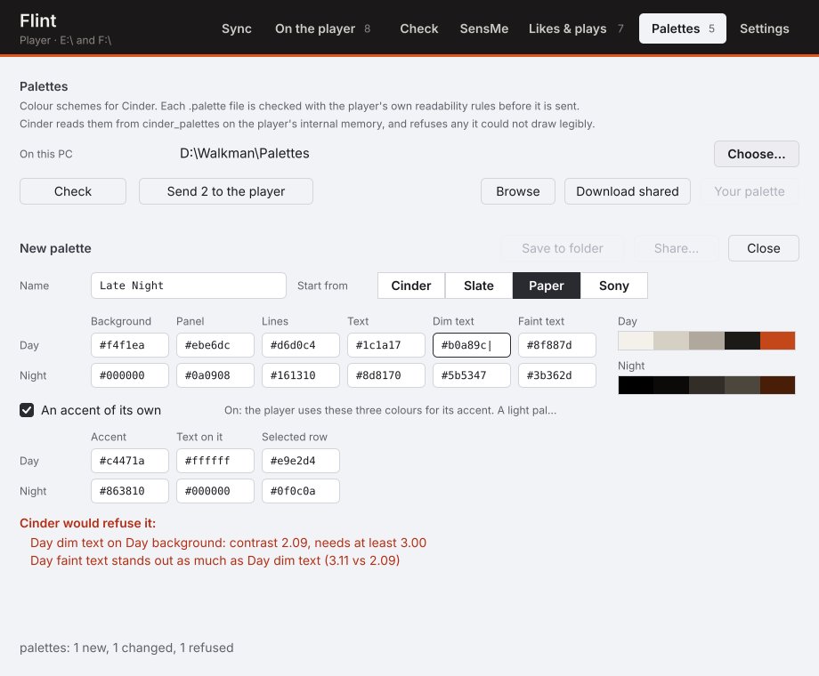
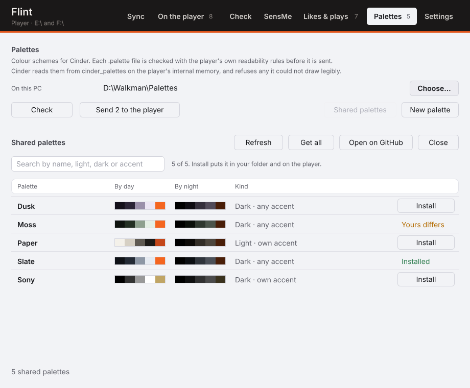

# Flint

PC companion for the Sony NW-A50-series Walkman and [Cinder](https://github.com/superwilso/Cinder).
Copies your library to the player, adds Sony's **SensMe** mood and tempo data to the copies, and
syncs scrobbles and liked songs with Last.fm. It never modifies the files on your PC.

**Status:** usable, still young. Latest release: [v0.2.1](https://github.com/superwilso/flint/releases/latest)
(Windows and Linux, SHA-256 sums and build attestations on the release page). `main` may be ahead;
see *Unreleased* in [`CHANGELOG.md`](CHANGELOG.md). Replaces the Python `Sony-sync` tool.

## Getting started

1. From [Releases](https://github.com/superwilso/flint/releases/latest), download
   `flint-windows-x64.exe`. It is the only file you need.
2. Connect the Walkman as a USB drive and run `flint-windows-x64.exe`.
3. On **Sync**, pick your music folder and the player's drive (and its card, if any).
4. Press **Show what would happen**. Nothing is written yet.
5. Press **Copy to the player**.

Everything the window does is also a command: run the same file from a terminal with a command
after it (Linux: `flint-linux-x64`). At a `cmd` prompt, `start /wait flint-windows-x64.exe ...`
makes the prompt wait for it.

## SensMe

The Walkman builds SensMe channels from an analysis tag in each file. Sony's Music Center writes that
tag into your PC files, which can grow each one by close to a megabyte. Flint instead:

- runs Sony's own engine (`MMLib11.dll`, installed with Music Center for PC) once per track and
  caches the result, about 6 KB each;
- writes it only into the copy on the Walkman, in the same containers Sony uses (FLAC `SMFM` block,
  MP3 `GEOB` frame).

The player's own scanner does the rest, so it works on stock firmware as well as Cinder. Flint does
not ship Sony's engine: SensMe analysis needs Music Center installed on the same PC. Nothing else in
Flint does.

**Already using Music Center?** Tags already in your files are used as-is, and `flint import` reads
Music Center's own analysis cache (read-only). Either way the Walkman copy carries only the ~6 KB
the player reads. Full comparison: [`docs/MUSIC_CENTER.md`](docs/MUSIC_CENTER.md).

## The window


| Page | What it does |
|---|---|
| **Sync** | Plans the copy (what's added, removed, tagged, and whether it fits), then copies. |
| **On the player** | Lists what's on each drive and whether Flint put it there, with the ratings and play counts the player keeps. Takes playlists you changed on the player back to the PC. |
| **Check** | Finds FLACs that aren't really lossless. Click a verdict or type to filter. |
| **SensMe** | Analyses the library, or imports Music Center's results. |
| **Likes & plays** | Sends scrobbles to Last.fm and syncs liked songs. |
| **Palettes** | Makes Cinder colour palettes, checks them with Cinder's own rules and sends the ones that pass. **Shared palettes** lists everything in [cinder-themes](https://github.com/superwilso/cinder-themes): search it, see each one by day and night, and install one onto the player in one click. |
| **Settings** | Theme, folders, the analysis cache, Last.fm key and sign-in. |






Only **Sync** writes music, and **Copy** is only offered for a plan you've just seen. Changing a
setting withdraws it until you look again. Each drive shows a bar: used, this copy, free.

Jobs run side by side, so a long analysis doesn't lock the window. Two jobs wait for each other only
if they share something (the cache, the player, Last.fm), and a greyed button says what it's waiting
for. Planning and copying wait for a running analysis, since the copies carry its results.

The theme follows Windows' light/dark setting unless you pick one in Settings (or run
`flint gui --light` / `--dark`).


The window is drawn with no UI toolkit. Its layout is plain Rust, so the pictures here are rendered
by Flint itself:

```
flint gui-preview window.svg --state planned     # fresh, ready, working, done, scanning
flint gui-preview window-dark.svg --state planned --dark
flint gui-preview check.svg --state check        # filtered, player, sensme, likes, palettes, palette-new, palette-shop, settings, signed-in
```

## Copying a library

```
flint scan "D:\\Music"                                                    analyse once
flint sync "D:\\Music" --to E:\\ --to F:\\ --playlists "D:\\Playlists"          dry run
flint sync "D:\\Music" --to E:\\ --to F:\\ --playlists "D:\\Playlists" --apply  copy
```

- The music goes into the drive's `MUSIC` folder when it has one, which is where a Walkman looks.
  The plan names the folder it will write to and sweep.
- Albums move as a unit and are never split between internal memory and the card. Albums that share
  a playlist stay on the same volume, and an album already on a volume stays there.
- `--playlists` reads `.m3u`, `.m3u8` and MusicBee `.mbp` files; each reaches the player as an
  `.m3u8`.
- Each volume is filled to its free space minus 0.5 GB; `--gb N` sets a budget instead.
  `--no-sensme` copies without tagging.
- Cover art and lyrics (`.jpg`, `.png`, `.lrc`) in an album folder are copied with it;
  `--no-extras` leaves them on the PC. Flint never deletes artwork it didn't put there.
- Copies are written to a temp file and renamed, so an interrupted copy leaves the old file or the
  new one, never half of one. `flint-manifest.tsv` on each volume records what each copy came from.

## Scrobbles and liked songs

The Walkman has no network, so it writes files and Flint carries them.

**In the window:** Settings ▸ Last.fm. **Get a key on last.fm** opens the page that makes an API key
(any app name, no callback URL). Paste the key and secret, **Save**, then **Sign in with Last.fm**
and approve in your browser. Flint never sees your password. Then use **Likes & plays**.

**From a terminal:**

```
flint lastfm key <api-key> <api-secret>     once — https://www.last.fm/api/account/create
flint lastfm login <your-username>          once — exchanges the password for a session key
flint lastfm status

flint scrobble E:\                          show what would be sent
flint scrobble E:\ --apply                  send it

flint likes E:\ F:\                         show what would change, both ways
flint likes E:\ F:\ --apply --playlist      apply, and write Liked Songs.m3u8
```

**Scrobbles.** Cinder writes an Audioscrobbler `.scrobbler.log` at the root of the player. Flint
sends the plays in batches of 50 and removes only the rows Last.fm accepted. Rejected or unreadable
rows stay, with the reason printed. The player's clock has no time zone, so the log says
`#TZ/UNKNOWN` and Flint converts each time to UTC with this PC's time zone before sending it.

**Liked songs.** Cinder exports `cinder_loved.tsv` and reads `cinder_liked_import.tsv`. `flint likes`
syncs these with your Last.fm loved tracks in both directions. It remembers the last state of each
side (`likes-state.tsv`) so it can tell an unlike from a new like:

- the first run only adds, never removes;
- a player that isn't connected causes no removals;
- a track changed on both sides keeps the like.

Tracks match on artist and title, ignoring case, `feat.` credits and remaster/edition suffixes. Live,
remix, acoustic and demo versions stay separate. `--playlist` also writes `Liked Songs.m3u8` per
volume (off by default: it reads every file's tags over USB).

Network calls use the OS's own TLS (WinHTTP on Windows). Only a session key is stored, in
`lastfm.conf`; revoke it at last.fm/settings/applications.

## Ratings, play counts and the player's own playlists

Cinder keeps three things on the player that Sony's database has no place for: star ratings and
play counts (`cinder_stats.tsv`), smart playlists (`cinder_views.conf`) and the playlists you make
on the player (`cinder_playlists`). A sync never removes any of them.

**In the window**, *On the player* shows each album's stars and plays, and counts the rated tracks,
the smart playlists and the playlists made on the player. The log names each one.

```
flint stats E:\ --to F:\                     show ratings, counts and smart playlists
flint stats E:\ --to F:\ --apply             seed play counts, and move history with moved albums

flint playlists E:\                          list the playlists made on the player
flint playlists E:\ --to "D:\Playlists\From the player" --library "D:\Music" --apply
```

**Ratings follow their files.** The player keeps a rating under the file's path. When a sync
moves an album between internal memory and the card, its ratings and play counts move with it; the
window and `flint sync --apply` do this at the end of every copy. A track that is on neither drive
keeps its row, so its rating returns if the album does. With the card out, nothing is moved.

**Play counts from history.** `flint stats --apply` gives tracks the player has never counted
their plays from `.scrobbler.log`. A count or rating the player already has is never changed.

**Playlists changed on the player.** Cinder marks a playlist it has changed as EDITED until a PC
has taken it. **Take playlists back** (or `flint playlists --to`) writes each changed playlist to
the PC, naming the files in your music folder so any player can open it, and only then takes the
mark off. The window puts them in `From the player` inside your playlists folder; a sync does not
send that folder back, so the player does not end up with two copies. A file of the same name
already on the PC that differs is kept beside the new one as `.bak`.

## Checking for fake FLACs

`flint check` flags FLACs that aren't the lossless audio they claim to be. Needs FFmpeg only.

```
flint check "D:\Music"            every FLAC under a folder
flint check track.flac --verbose  one file, with its spectrum
```

| Verdict | Meaning |
|---|---|
| `LOSSY` | Audio cuts off at a lossy encoder's lowpass |
| `SUSPECT` | Cuts off between 19.5 and 21 kHz: a high-bitrate encode, or just the master |
| `UPSAMPLED` | 88.2 kHz or higher with nothing above CD/DAT bandwidth |
| `PADDED` | 24-bit file using only 16 bits |
| `DAMAGED` | FFmpeg reported decode errors |


Tested on transcodes of four albums: MP3 128 and 320, Opus 160, upsampled and bit-padded copies were
all caught; Vorbis q6 1 of 4; LAME V0 and AAC 256 none (they keep content up to ~22 kHz). No
originals were flagged. A clean result isn't proof, and `SUSPECT` isn't an accusation. Results are
cached by audio content, so moved or retagged files aren't decoded again.

## Layout

| Crate | Contents |
|---|---|
| `flint-core` | FLAC/ID3v2 read and write, the SensMe chunk format, decode → engine pipeline, Music Center import |
| `flint` | The program: the window with no arguments, the command line with a command |
| `flint-gui` | The window: layout in plain Rust, painted with GDI on Windows or written as SVG anywhere |
| `sensme-helper` | 32-bit Windows helper that loads Sony's 32-bit engine |

## Building

```
cargo test
cargo build --release --target i686-pc-windows-gnu -p sensme-helper
FLINT_HELPER_EXE=$PWD/target/i686-pc-windows-gnu/release/sensme-helper.exe \
    cargo build --release --target x86_64-pc-windows-gnu -p flint --features embed-helper
```

Without `--features embed-helper`, Flint looks for `sensme-helper.exe` beside itself.

Both Windows targets cross-compile from Linux with mingw-w64.

## Releasing

```
tools/release.sh v0.2.0 --dry-run     show what would change
tools/release.sh v0.2.0               1st run: prepare, then commit the diff it lists
tools/release.sh v0.2.0               2nd run: push, tag, wait for CI, print the release page
```

The first run bumps the version, moves *Unreleased* in `CHANGELOG.md` into the new version (that
section becomes the release notes), updates the README link, redraws the window pictures and runs
every gate. It never commits. A tag with a suffix (`v0.2.0-rc1`) publishes as a pre-release.

## Licence

MIT. Sony's engine is not part of this repository and is not redistributed.
